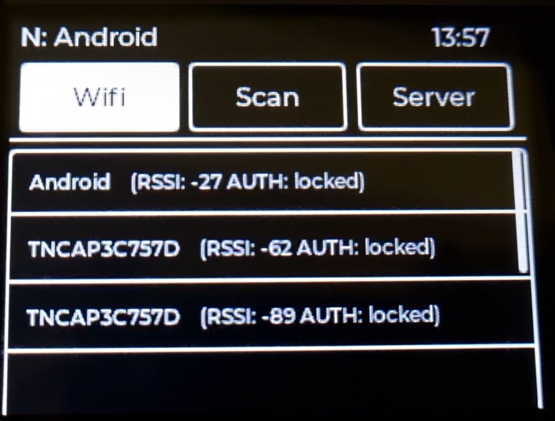
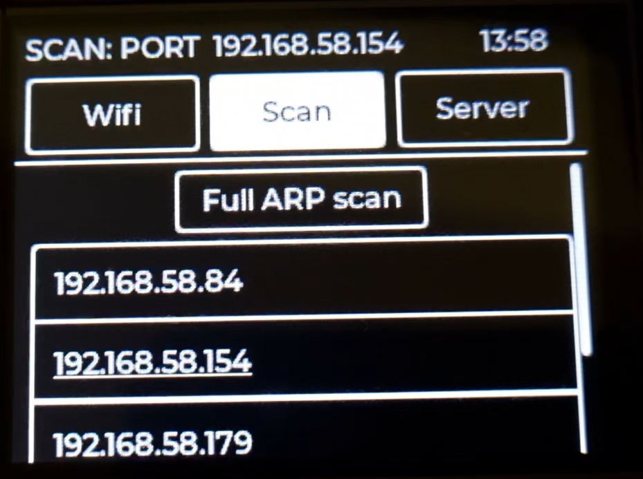
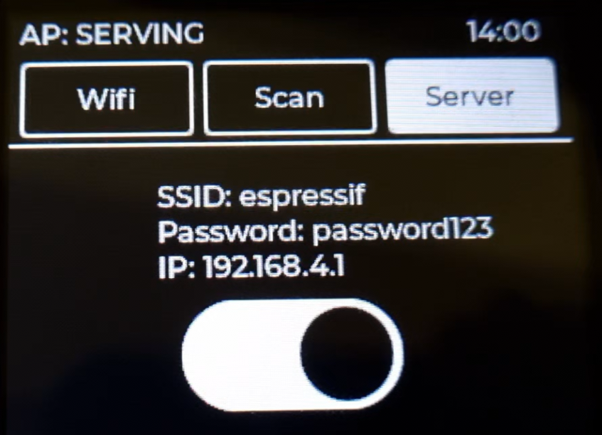
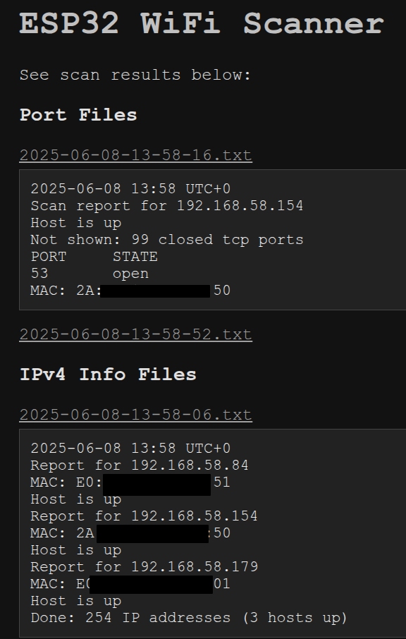

# What?

A simple nearby WiFi access point (AP) and in-network online device and open port scanner using an ESP32. A LVGL graphical interface is used to connect to WiFi (sorry, you have to input the password) and to execute scans. The display used is a ILI9341 TFT display with touch capabilities. All scanned data is stored in flash using a LittleFS filesystem and can be accessed by connecting to the ESP32 in AP mode and opening the ESP32 IP in any web browser.

There are three types of scans. First is a simple scan of nearby Access Points (WiFi) that is periodically executed when not connected. Second type is a full ARP scan that scans the entire subnet range of the network by sending a single ARP request to each IP in batches and reading the ARP table after a small timeout. Third type is a TCP port scan that tries to establish a TCP connection with every port in a predefined port range of a target IP (list of valid IP's is generated from an ARP scan) - ports that are open are stored in flash. Results of all scans are stored in their respective directories in flash with the filename being when the scan finished. List of results are available in serving mode.

Some scan and AP values can be configured in `./main/conf.h`. A slightly more detailed explanation of scans is provided there as well. Some configuration options may be found in `sdkconfig`.

# Build and flash

The building and flashing commands are assuming you have `esp-idf` repository cloned in `./esp-idf` at root of this project directory. That is not a requirement as long as you have cloned this repo with submodules recursed and have installed ESP-IDF v4.4.8 somewhere where you can source `export.sh` and then run the required build and flash commands with `idf.py`.

## Dependencies

**The versions are very important!**

- [ESP-IDF v4.4.8](https://github.com/espressif/esp-idf/releases/tag/v4.4.8)
- [LVGL v7.11](https://github.com/lvgl/lvgl/releases/tag/v7.11.0)
- [LVGL ESP32 drivers (commit 9fed1cc4)](https://github.com/lvgl/lvgl_esp32_drivers/commit/9fed1cc47b5a45fec6bae08b55d2147d3b50260c), the provided drivers in this repo have a few fixes that are required for this project
- [LittleFS v1.16.4](https://components.espressif.com/components/joltwallet/littlefs/versions/1.16.4?language=en)
- lwip (provided by ESP-IDF)

## Linux

### 1. Clone this repository, including any submodules in ./components

1. `git clone https://github.com/rvndsy/esp32-wireless-scanner.git --recurse-submodules && cd esp32-wireless-scanner`

### 2. Install ESP-IDF (tool used for building and flashing to ESP32):

1. `git clone https://github.com/espressif/esp-idf -b v4.4.8`

2. `./esp-idf/install.sh`

This will install and store esp-idf files locally within this repository (no root needed).

### 3. Build with ESP-IDF

1. `. ./esp-idf/export.sh` (sourcing Python environment)

2. `./esp-idf/tools/idf.py build`

### 4. Flash onto ESP32

1. `./esp-idf/tools/idf.py flash` or `./esp-idf/tools/idf.py -p <PORT> flash` (port is something similar to /dev/ttyUSB0, if your user has permission issues [then add it to `dialout` or `uucp` group](https://support.arduino.cc/hc/en-us/articles/360016495679-Fix-port-access-on-Linux))

Alternatively, run `./build.sh` to build this project (assuming esp-idf is cloned in ./esp-idf) or `./run.sh` to build & flash it.

### Read serial information

`./esp-idf/tools/idf.py monitor -p <PORT>`

## Windows

1. Clone this repository, including any submodules in ./components
2. Use the Windows ESP-IDF software to build and flash this project with similar commands to the **Linux** section.

# Architecture

Each of the 6 .c files in `./main` have a role:

- `esp32-wifi-scanner.c` contains the `app_main()` function that initializes the ESP32, LittleFS, other necessities and initializes the main threads. The calls to create threads and communication between them happen here. The two most important threads are the LVGL GUI task `gui_task` (initializes LVGL, drivers, LVGL timer, and the GUI elements from `gui.c`) and the task that manages everything to do with networking (looking for AP's, connecting to an AP, executing ARP and port scans, ) called `wifi_task`. Most of the LVGL button callbacks are located here.
- `gui.c` contains functions to initialize the main bulk of graphical elements. Some LVGL functions to create buttons (ex. for AP and IP lists) and to update labels (ex. status bar) are in `esp32-wifi-scanner.c`.
- `port-scanner.c` contains the logic for scanning ports of some IPv4 address.
- `net-scanner.c` contains the logic for scanning a subnet (or a single host) with ARP requests.
- `http-server.c` is the HTTP server and all the backend logic that always gets started in serving/softAP mode.
- `file-writing.c` contains functions to write the last recorded information from any scans into files that are on the LittleFS filesystem. The functions are called in `app_main()` immediately after finishing any scan.

A directory `./server-image` may contain files that are copied to the LittleFS root directory to be used by the HTTP server.

Certainly some improvements can be made in the structure of code and files. This project was a personal exercise to learn a few different libraries on an ESP32 and I had no expectations of how it would turn out from the start.

# Example photos

